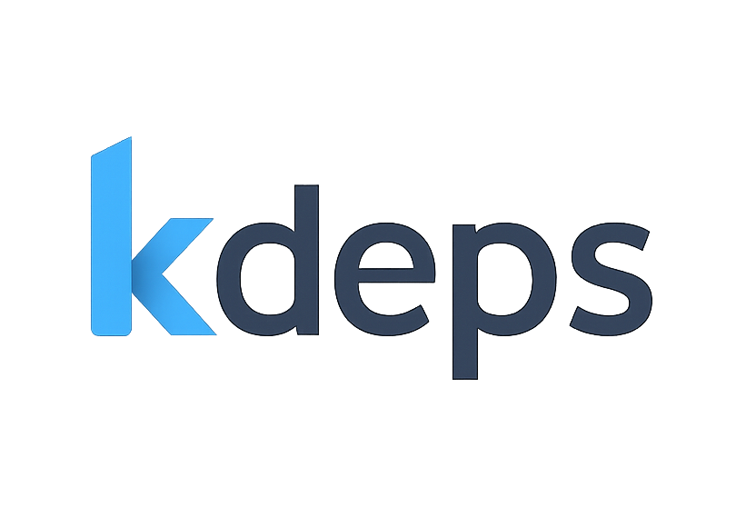

<p align="center">
  
</p>


[](https://goreportcard.com/report/github.com/kdeps/kdeps)
[](https://github.com/kdeps/kdeps/actions/workflows/build-test.yml)
[](https://github.com/kdeps/kdeps/actions/workflows/build-test.yml)

Kdeps is an all-in-one AI framework for building Dockerized full-stack AI applications (FE and BE) that includes
open-source LLM models out-of-the-box.

> 📋 **New**: Read our comprehensive [**KDeps Whitepaper**](./KDeps_Whitepaper.md) for detailed technical insights, architecture overview, and competitive analysis.

## Key Features

Kdeps is loaded with features to streamline full-stack AI app development:

<details>
  <summary>🧩 Low-code/no-code capabilities</summary>
  Build <a href="https://kdeps.com/getting-started/configuration/workflow.html">operational full-stack AI apps</a>, enabling accessible development for non-technical users.

```pkl
// workflow.pkl
Name = "ticketResolutionAgent"
Description = "Automates customer support ticket resolution with LLM responses."
Version = "1.0.0"
TargetActionID = "responseResource"
Settings {
  APIServerMode = true
  APIServer {
    HostIP = "127.0.0.1"
    PortNum = 3000
    Routes {
      new { Path = "/api/v1/ticket"; Methods { "POST" } }
    }
    CORS { EnableCORS = true; AllowOrigins { "http://localhost:8080" } }
  }
  AgentSettings {
    Timezone = "Etc/UTC"
    Models { "llama3.2:1b" }
    OllamaImageTag = "0.6.8"
  }
}
```

```pkl
// resources/fetch_data.pkl
ActionID = "httpFetchResource"
Name = "CRM Fetch"
Description = "Fetches ticket data via CRM API."
run {
  RestrictToHTTPMethods { "POST" }
  RestrictToRoutes { "/api/v1/ticket" }
  PreflightCheck {
    Validations { "@(request.data().ticket_id)" != "" }
  }
  HTTPClient {
    Method = "GET"
    Url = "https://crm.example.com/api/ticket/@(request.data().ticket_id)"
    Headers { ["Authorization"] = "Bearer @(session.getRecord('crm_token'))" }
    TimeoutDuration = 30.s
  }
}
```

```pkl
// resources/llm.pkl
ActionID = "llmResource"
Name = "LLM Ticket Response"
Description = "Generates responses for customer tickets."
Requires { "httpFetchResource" }
run {
  RestrictToHTTPMethods { "POST" }
  RestrictToRoutes { "/api/v1/ticket" }
  Chat {
    Model = "llama3.2:1b"
    Role = "assistant"
    Prompt = "Provide a professional response to the customer query: @(request.data().query)"
    Scenario {
      new { Role = "system"; Prompt = "You are a customer support assistant. Be polite and concise." }
      new { Role = "system"; Prompt = "Ticket data: @(client.responseBody("httpFetchResource"))" }
    }
    JSONResponse = true
    JSONResponseKeys { "response_text" }
    TimeoutDuration = 60.s
  }
}
```

```pkl
// resources/response.pkl
ActionID = "responseResource"
Name = "API Response"
Description = "Returns ticket resolution response."
Requires { "llmResource" }
run {
  RestrictToHTTPMethods { "POST" }
  RestrictToRoutes { "/api/v1/ticket" }
  APIResponse {
    Success = true
    Response {
      Data { "@(llm.response('llmResource'))" }
    }
    Meta { Headers { ["Content-Type"] = "application/json" } }
  }
}
```
</details>

<details>
  <summary>🐳 Dockerized full-stack AI apps</summary>
  Build applications with <a href="https://kdeps.com/getting-started/introduction/quickstart.html#quickstart">batteries included</a> for seamless development and deployment, as detailed in the <a href="https://kdeps.com/getting-started/configuration/workflow.html#ai-agent-settings">AI agent settings</a>.

```pkl
# Creating a Docker image of the kdeps AI agent is easy!
# First, package the AI agent project.
$ kdeps package tickets-ai/
INFO kdeps package created package-file=tickets-ai-1.0.0.kdeps
# Then build a docker image and run.
$ kdeps run tickets-ai-1.0.0.kdeps
# It also creates a Docker compose configuration file.
```

```pkl
# docker-compose.yml
version: '3.8'
services:
  kdeps-tickets-ai-cpu:
    image: kdeps-tickets-ai:1.0.0
    ports:
      - "127.0.0.1:3000"
    restart: on-failure
    volumes:
      - ollama:/root/.ollama
      - kdeps:/.kdeps
volumes:
  ollama:
    external:
      name: ollama
  kdeps:
    external:
      name: kdeps
```
</details>

<details>
  <summary>🖼️ Support for vision or multimodal LLMs</summary>
  Process text, images, and other data types in a single workflow with <a href="https://kdeps.com/getting-started/resources/multimodal.html">vision or multimodal LLMs</a>.

```pkl
// workflow.pkl
Name = "visualTicketAnalyzer"
Description = "Analyzes images in support tickets for defects using a vision model."
Version = "1.0.0"
TargetActionID = "responseResource"
Settings {
  APIServerMode = true
  APIServer {
    HostIP = "127.0.0.1"
    PortNum = 3000
    Routes {
      new { Path = "/api/v1/visual-ticket"; Methods { "POST" } }
    }
    CORS { EnableCORS = true; AllowOrigins { "http://localhost:8080" } }
  }
  AgentSettings {
    Timezone = "Etc/UTC"
    Models { "llama3.2-vision" }
    OllamaImageTag = "0.6.8"
  }
}
```

```pkl
// resources/fetch_data.pkl
ActionID = "httpFetchResource"
Name = "CRM Fetch"
Description = "Fetches ticket data via CRM API."
run {
  RestrictToHTTPMethods { "POST" }
  RestrictToRoutes { "/api/v1/ticket" }
  PreflightCheck {
    Validations { "@(request.data().ticket_id)" != "" }
  }
  HTTPClient {
    Method = "GET"
    Url = "https://crm.example.com/api/ticket/@(request.data().ticket_id)"
    Headers { ["Authorization"] = "Bearer @(session.getRecord('crm_token'))" }
    TimeoutDuration = 30.s
  }
}
```

```pkl
// resources/llm.pkl
ActionID = "llmResource"
Name = "Visual Defect Analyzer"
Description = "Analyzes ticket images for defects."
Requires { "httpFetchResource" }
run {
  RestrictToHTTPMethods { "POST" }
  RestrictToRoutes { "/api/v1/visual-ticket" }
  PreflightCheck {
    Validations { "@(request.filecount())" > 0 }
  }
  Chat {
    Model = "llama3.2-vision"
    Role = "assistant"
    Prompt = "Analyze the image for product defects and describe any issues found."
    Files { "@(request.files()[0])" }
    Scenario {
      new { Role = "system"; Prompt = "You are a support assistant specializing in visual defect detection." }
      new { Role = "system"; Prompt = "Ticket data: @(client.responseBody("httpFetchResource"))" }
    }
    JSONResponse = true
    JSONResponseKeys { "defect_description"; "severity" }
    TimeoutDuration = 60.s
  }
}
```

```pkl
// resources/response.pkl
ActionID = "responseResource"
Name = "API Response"
Description = "Returns defect analysis result."
Requires { "llmResource" }
run {
  RestrictToHTTPMethods { "POST" }
  RestrictToRoutes { "/api/v1/visual-ticket" }
  APIResponse {
    Success = true
    Response {
      Data { "@(llm.response('llmResource'))" }
    }
    Meta { Headers { ["Content-Type"] = "application/json" } }
  }
}
```
</details>

<details>
  <summary>🔌 Create custom AI APIs</summary>
  Serve <a href="https://kdeps.com/getting-started/configuration/workflow.html#llm-models">open-source LLMs</a> through custom <a href="https://kdeps.com/getting-started/configuration/workflow.html#api-server-settings">AI APIs</a> for robust AI-driven applications.
</details>

<details>
  <summary>🌐 Pair APIs with frontend apps</summary>
  Integrate with frontend apps like Streamlit, NodeJS, and more for interactive AI-driven user interfaces, as outlined in <a href="https://kdeps.com/getting-started/configuration/workflow.html#web-server-settings">web server settings</a>.

```pkl
// workflow.pkl
Name = "frontendAIApp"
Description = "Pairs an AI API with a Streamlit frontend for text summarization."
Version = "1.0.0"
TargetActionID = "responseResource"
Settings {
  APIServerMode = true
  WebServerMode = true
  APIServer {
    HostIP = "127.0.0.1"
    PortNum = 3000
    Routes {
      new { Path = "/api/v1/summarize"; Methods { "POST" } }
    }
  }
  WebServer {
    HostIP = "127.0.0.1"
    PortNum = 8501
    Routes {
      new {
        Path = "/app"
        PublicPath = "/fe/1.0.0/web/"
        ServerType = "app"
        AppPort = 8501
        Command = "streamlit run app.py"
      }
    }
  }
  AgentSettings {
    Timezone = "Etc/UTC"
    PythonPackages { "streamlit" }
    Models { "llama3.2:1b" }
    OllamaImageTag = "0.6.8"
  }
}
```

```pkl
// data/fe/web/app.py (Streamlit frontend)
import streamlit as st
import requests

st.title("Text Summarizer")
text = st.text_area("Enter text to summarize")
if st.button("Summarize"):
  response = requests.post("http://localhost:3000/api/v1/summarize", json={"text": text})
  if response.ok:
    st.write(response.json()['response']['data']['summary'])
  else:
    st.error("Error summarizing text")
```

```pkl
// resources/llm.pkl
ActionID = "llmResource"
Name = "Text Summarizer"
Description = "Summarizes input text using an LLM."
run {
  RestrictToHTTPMethods { "POST" }
  RestrictToRoutes { "/api/v1/summarize" }
  Chat {
    Model = "llama3.2:1b"
    Role = "assistant"
    Prompt = "Summarize this text in 50 words or less: @(request.data().text)"
    JSONResponse = true
    JSONResponseKeys { "summary" }
    TimeoutDuration = 60.s
  }
}
```
</details>

<details>
  <summary>🛠️ Let LLMs run tools automatically (aka MCP or A2A)</summary>
  Enhance functionality through scripts and sequential tool pipelines with <a href="https://kdeps.com/getting-started/resources/llm.html#tools-configuration">external tools and chained tool workflows</a>.

```pkl
// workflow.pkl
Name = "toolChainingAgent"
Description = "Uses LLM to query a database and generate a report via tools."
Version = "1.0.0"
TargetActionID = "responseResource"
Settings {
  APIServerMode = true
  APIServer {
    HostIP = "127.0.0.1"
    PortNum = 3000
    Routes {
      new { Path = "/api/v1/report"; Methods { "POST" } }
    }
  }
  AgentSettings {
    Timezone = "Etc/UTC"
    Models { "llama3.2:1b" }
    OllamaImageTag = "0.6.8"
  }
}
```

```pkl
// resources/llm.pkl
ActionID = "llmResource"
Name = "Report Generator"
Description = "Generates a report using a database query tool."
run {
  RestrictToHTTPMethods { "POST" }
  RestrictToRoutes { "/api/v1/report" }
  Chat {
    Model = "llama3.2:1b"
    Role = "assistant"
    Prompt = "Generate a sales report based on database query results. Date range: @(request.params("date_range"))"
    Tools {
      new {
        Name = "query_sales_db"
        Script = "@(data.filepath('tools/1.0.0', 'query_sales.py'))"
        Description = "Queries the sales database for recent transactions"
        Parameters {
          ["date_range"] { Required = true; Type = "string"; Description = "Date range for query (e.g., '2025-01-01:2025-05-01')" }
        }
      }
    }
    JSONResponse = true
    JSONResponseKeys { "report" }
    TimeoutDuration = 60.s
  }
}
```

```pkl
// data/tools/query_sales.py
import sqlite3
import sys

def query_sales(date_range):
  start, end = date_range.split(':')
  conn = sqlite3.connect('sales.db')
  cursor = conn.execute("SELECT * FROM transactions WHERE date BETWEEN ? AND ?", (start, end))
  results = cursor.fetchall()
  conn.close()
  return results

print(query_sales(sys.argv[1]))
```
</details>

## Additional Features

<details>
  <summary>📈 Context-aware RAG workflows</summary>
  Enable accurate, knowledge-intensive tasks with <a href="https://kdeps.com/getting-started/resources/kartographer.html">RAG workflows</a>.
</details>

<details>
  <summary>📊 Generate structured outputs</summary>
  Create consistent, machine-readable responses from LLMs, as described in the <a href="https://kdeps.com/getting-started/resources/llm.html#chat-block">chat block documentation</a>.

```pkl
// workflow.pkl
Name = "structuredOutputAgent"
Description = "Generates structured JSON responses from LLM."
Version = "1.0.0"
TargetActionID = "responseResource"
Settings {
  APIServerMode = true
  APIServer {
    HostIP = "127.0.0.1"
    PortNum = 3000
    Routes {
      new { Path = "/api/v1/structured"; Methods { "POST" } }
    }
  }
  AgentSettings {
    Timezone = "Etc/UTC"
    Models { "llama3.2:1b" }
    OllamaImageTag = "0.6.8"
  }
}
```

```pkl
// resources/llm.pkl
ActionID = "llmResource"
Name = "Structured Response Generator"
Description = "Generates structured JSON output."
run {
  RestrictToHTTPMethods { "POST" }
  RestrictToRoutes { "/api/v1/structured" }
  Chat {
    Model = "llama3.2:1b"
    Role = "assistant"
    Prompt = "Analyze this text and return a structured response: @(request.data().text)"
    JSONResponse = true
    JSONResponseKeys { "summary"; "keywords" }
    TimeoutDuration = 60.s
  }
}
```
</details>

<details>
  <summary>🔄 Items iteration</summary>
  Iterate over multiple items in a resource to process them sequentially, using <a href="https://kdeps.com/getting-started/resources/items.html">items iteration</a> with `item.current()`, `item.prev()`, and `item.next()`.

```pkl
// workflow.pkl
Name = "mtvScenarioGenerator"
Description = "Generates MTV video scenarios based on song lyrics."
Version = "1.0.0"
TargetActionID = "responseResource"
Settings {
  APIServerMode = true
  APIServer {
    HostIP = "127.0.0.1"
    PortNum = 3000
    Routes {
      new { Path = "/api/v1/mtv-scenarios"; Methods { "GET" } }
    }
    CORS { EnableCORS = true; AllowOrigins { "http://localhost:8080" } }
  }
  AgentSettings {
    Timezone = "Etc/UTC"
    Models { "llama3.2:1b" }
    OllamaImageTag = "0.6.8"
  }
}
```

```pkl
// resources/llm.pkl
ActionID = "llmResource"
Name = "MTV Scenario Generator"
Description = "Generates MTV video scenarios for song lyrics."
Items {
  "A long, long time ago"
  "I can still remember"
  "How that music used to make me smile"
  "And I knew if I had my chance"
}
run {
  RestrictToHTTPMethods { "GET" }
  RestrictToRoutes { "/api/v1/mtv-scenarios" }
  SkipCondition {
    "@(item.current())" == "And I knew if I had my chance" // Skip this lyric
  }
  Chat {
    Model = "llama3.2:1b"
    Role = "assistant"
    Prompt = """
    Based on the lyric @(item.current()) from the song "American Pie," generate a suitable scenario for an MTV music video. The scenario should include a vivid setting, key visual elements, and a mood that matches the lyric's tone.
    """
    Scenario {
      new { Role = "system"; Prompt = "You are a creative director specializing in music video production." }
    }
    JSONResponse = true
    JSONResponseKeys { "setting"; "visual_elements"; "mood" }
    TimeoutDuration = 60.s
  }
}
```

```pkl
// resources/response.pkl
ActionID = "responseResource"
Name = "API Response"
Description = "Returns MTV video scenarios."
Requires { "llmResource" }
run {
  RestrictToHTTPMethods { "GET" }
  RestrictToRoutes { "/api/v1/mtv-scenarios" }
  APIResponse {
    Success = true
    Response {
      Data { "@(llm.response('llmResource'))" }
    }
    Meta { Headers { ["Content-Type"] = "application/json" } }
  }
}
```
</details>

<details>
  <summary>🤖 Leverage multiple open-source LLMs</summary>
  Use LLMs from <a href="https://kdeps.com/getting-started/configuration/workflow.html#llm-models">Ollama</a> and <a href="https://github.com/kdeps/examples/tree/main/huggingface_imagegen_api">Huggingface</a> for diverse AI capabilities.

```pkl
// workflow.pkl
Models {
  "tinydolphin"
  "llama3.3"
  "llama3.2-vision"
  "llama3.2:1b"
  "mistral"
  "gemma"
  "mistral"
}
```
</details>

<details>
  <summary>🗂️ Upload documents or files</summary>
  Process documents for LLM analysis, ideal for document analysis tasks, as shown in the <a href="https://kdeps.com/getting-started/tutorials/files.html">file upload tutorial</a>.

```pkl
// workflow.pkl
Name = "docAnalysisAgent"
Description = "Analyzes uploaded documents with LLM."
Version = "1.0.0"
TargetActionID = "responseResource"
Settings {
  APIServerMode = true
  APIServer {
    HostIP = "127.0.0.1"
    PortNum = 3000
    Routes {
      new { Path = "/api/v1/doc-analyze"; Methods { "POST" } }
    }
  }
  AgentSettings {
    Timezone = "Etc/UTC"
    Models { "llama3.2-vision" }
    OllamaImageTag = "0.6.8"
  }
}
```

```pkl
// resources/llm.pkl
ActionID = "llmResource"
Name = "Document Analyzer"
Description = "Extracts text from uploaded documents."
run {
  RestrictToHTTPMethods { "POST" }
  RestrictToRoutes { "/api/v1/doc-analyze" }
  PreflightCheck {
    Validations { "@(request.filecount())" > 0 }
  }
  Chat {
    Model = "llama3.2-vision"
    Role = "assistant"
    Prompt = "Extract key information from this document."
    Files { "@(request.files()[0])" }
    JSONResponse = true
    JSONResponseKeys { "key_info" }
    TimeoutDuration = 60.s
  }
}
```
</details>

<details>
  <summary>🔄 Reusable AI agents</summary>
  Create flexible workflows with <a href="https://kdeps.com/getting-started/resources/remix.html">reusable AI agents</a>.

```pkl
// workflow.pkl
Name = "docAnalysisAgent"
Description = "Analyzes uploaded documents with LLM."
Version = "1.0.0"
TargetActionID = "responseResource"
Workflows { "@ticketResolutionAgent" }
Settings {
  APIServerMode = true
  APIServer {
    HostIP = "127.0.0.1"
    PortNum = 3000
    Routes {
      new { Path = "/api/v1/doc-analyze"; Methods { "POST" } }
    }
  }
  AgentSettings {
    Timezone = "Etc/UTC"
    Models { "llama3.2-vision" }
    OllamaImageTag = "0.6.8"
  }
}
```

```pkl
// resources/response.pkl
ActionID = "responseResource"
Name = "API Response"
Description = "Returns defect analysis result."
Requires {
  "llmResource"
  "@ticketResolutionAgent/llmResource:1.0.0"
}
run {
  RestrictToHTTPMethods { "POST" }
  RestrictToRoutes { "/api/v1/doc-analyze" }
  APIResponse {
    Success = true
    Response {
      Data {
        "@(llm.response("llmResource"))"
        "@(llm.response('@ticketResolutionAgent/llmResource:1.0.0'))"
      }
    }
    Meta { Headers { ["Content-Type"] = "application/json" } }
  }
}
```
</details>

<details>
  <summary>🐍 Execute Python in isolated environments</summary>
  Run Python code securely using <a href="https://kdeps.com/getting-started/resources/python.html">Anaconda</a> in isolated environments.

```pkl
// resources/python.pkl
ActionID = "pythonResource"
Name = "Data Formatter"
Description = "Formats extracted data for storage."
run {
  RestrictToHTTPMethods { "POST" }
  RestrictToRoutes { "/api/v1/scan-document" }
  Python {
    Script = """
import pandas as pd

def format_data(data):
  df = pd.DataFrame([data])
  return df.to_json()

print(format_data(@(llm.response('llmResource'))))
"""
    TimeoutDuration = 60.s
  }
}
```
</details>

<details>
  <summary>🌍 Make API calls</summary>
  Perform API calls directly from configuration, as detailed in the <a href="https://kdeps.com/getting-started/resources/client.html">client documentation</a>.

```pkl
// resources/http_client.pkl
ActionID = "httpResource"
Name = "DMS Submission"
Description = "Submits extracted data to document management system."
run {
  RestrictToHTTPMethods { "POST" }
  RestrictToRoutes { "/api/v1/scan-document" }
  HTTPClient {
    Method = "POST"
    Url = "https://dms.example.com/api/documents"
    Data { "@(python.stdout('pythonResource'))" }
    Headers { ["Authorization"] = "Bearer @(session.getRecord('dms_token'))" }
    TimeoutDuration = 30.s
  }
}
```
</details>

<details>
  <summary>🚀 Run in Lambda or API mode</summary>
  Operate in <a href="https://kdeps.com/getting-started/configuration/workflow.html#lambda-mode">Lambda mode</a> or <a href="https://kdeps.com/getting-started/configuration/workflow.html#api-server-settings">API mode</a> for flexible deployment.
</details>

<details>
  <summary>✅ Built-in validations and checks</summary>
  Utilize <a href="https://kdeps.com/getting-started/resources/api-request-validations.html#api-request-validations">API request validations</a>, <a href="https://kdeps.com/getting-started/resources/validations.html">custom validation checks</a>, and <a href="https://kdeps.com/getting-started/resources/skip.html">skip conditions</a> for robust workflows.

```pkl
RestrictToHTTPMethods { "POST" }
RestrictToRoutes { "/api/v1/scan-document" }
PreflightCheck {
  Validations { "@(request.filetype('document'))" == "image/jpeg" }
}
SkipCondition { "@(request.data().query.length)" < 5 }
```
</details>

<details>
  <summary>📁 Serve static websites or reverse-proxied apps</summary>
  Host <a href="https://kdeps.com/getting-started/configuration/workflow.html#static-file-serving">static websites</a> or <a href="https://kdeps.com/getting-started/configuration/workflow.html#reverse-proxying">reverse-proxied apps</a> directly.

```pkl
// workflow.pkl
Name = "frontendAIApp"
Description = "Pairs an AI API with a Streamlit frontend for text summarization."
Version = "1.0.0"
TargetActionID = "responseResource"
Settings {
  APIServerMode = true
  WebServerMode = true
  APIServer {
    HostIP = "127.0.0.1"
    PortNum = 3000
    Routes {
      new { Path = "/api/v1/summarize"; Methods { "POST" } }
    }
  }
  WebServer {
    HostIP = "127.0.0.1"
    PortNum = 8501
    Routes {
      new {
        Path = "/app"
        ServerType = "app"
        AppPort = 8501
        Command = "streamlit run app.py"
      }
    }
  }
  AgentSettings {
    Timezone = "Etc/UTC"
    PythonPackages { "streamlit" }
    Models { "llama3.2:1b" }
    OllamaImageTag = "0.6.8"
  }
}
```
</details>

<details>
  <summary>💾 Manage state with memory operations</summary>
  Store, retrieve, and clear persistent data using <a href="https://kdeps.com/getting-started/resources/memory.html">memory operations</a>.

```pkl
expr {
  "@(memory.setRecord('user_data', request.data().data))"
}
local user_data = "@(memory.getRecord('user_data'))"
```
</details>

<details>
  <summary>🔒 Configure CORS rules</summary>
  Set <a href="https://kdeps.com/getting-started/configuration/workflow.html#cors-configuration">CORS rules</a> directly in the workflow for secure API access.

```pkl
// workflow.pkl
CORS {
  EnableCORS = true
  AllowOrigins { "https://example.com" }
  AllowMethods { "GET"; "POST" }
}
```
</details>

<details>
  <summary>🛡️ Set trusted proxies</summary>
  Enhance API and frontend security with <a href="https://kdeps.com/getting-started/configuration/workflow.html#trustedproxies">trusted proxies</a>.

```pkl
// workflow.pkl
APIServerMode = true
APIServer {
      HostIP = "127.0.0.1"
    PortNum = 3000
    Routes {
      new { Path = "/api/v1/proxy"; Methods { "GET" } }
    }
    TrustedProxies { "192.168.1.1"; "10.0.0.0/8" }
}
```
</details>

<details>
  <summary>🖥️ Run shell scripts</summary>
  Execute <a href="https://kdeps.com/getting-started/resources/exec.html">shell scripts</a> seamlessly within workflows.

```pkl
// resources/exec.pkl
ActionID = "execResource"
Name = "Shell Script Runner"
Description = "Runs a shell script."
run {
  Exec {
    Command = """
echo "Processing request at $(date)"
"""
    TimeoutDuration = 60.s
  }
}
```
</details>

<details>
  <summary>📦 Install Ubuntu packages</summary>
  Install <a href="https://kdeps.com/getting-started/configuration/workflow.html#ubuntu-packages">Ubuntu packages</a> via configuration for customized environments.

```pkl
// workflow.pkl
AgentSettings {
  Timezone = "Etc/UTC"
  Packages {
    "tesseract-ocr"
    "poppler-utils"
    "npm"
    "ffmpeg"
  }
  OllamaImageTag = "0.6.8"
}
```
</details>

<details>
  <summary>📜 Define Ubuntu repositories or PPAs</summary>
  Configure <a href="https://kdeps.com/getting-started/configuration/workflow.html#ubuntu-repositories">Ubuntu repositories or PPAs</a> for additional package sources.

```pkl
// workflow.pkl
Repositories {
  "ppa:alex-p/tesseract-ocr-devel"
}
```
</details>

<details>
  <summary>⚡ Written in high-performance Golang</summary>
  Benefit from the speed and efficiency of Golang for high-performance applications.
</details>

<details>
  <summary>📥 Easy to install</summary>
  Install and use Kdeps with a single command, as outlined in the <a href="https://kdeps.com/getting-started/introduction/installation.html">installation guide</a>.

```shell
# On macOS
brew install kdeps/tap/kdeps
# Windows, Linux, and macOS
curl -LsSf https://raw.githubusercontent.com/kdeps/kdeps/refs/heads/main/install.sh | sh
```
</details>

## Getting Started

Ready to explore Kdeps? Install it with a single command: [Installation Guide](https://kdeps.com/getting-started/introduction/installation.html).

Check out practical [examples](https://github.com/kdeps/examples) to jumpstart your projects.

## 📋 Whitepaper

For a comprehensive technical overview of KDeps, including architecture, use cases, and competitive analysis, read our [**KDeps Whitepaper**](./KDeps_Whitepaper.md).

The whitepaper covers:
- **Architecture Overview**: Detailed breakdown of KDeps' modular design
- **Core Components**: Workflow engine, resource system, and dependency resolver
- **Technical Implementation**: Technology stack and performance characteristics
- **Use Cases**: Real-world applications and implementation examples
- **Competitive Analysis**: Comparison with existing AI development platforms
- **Future Roadmap**: Development plans and strategic vision
