# Tools (Function Calling)

Tools let an LLM call other resources mid-response. When the LLM decides a tool is needed, kdeps runs the target resource, feeds the result back to the LLM, and the LLM continues. The LLM only sees the tool's output -- it does not see the resource YAML.

```mermaid
flowchart TD
    A([chat resource receives prompt]) --> B
    B["LLM: 'I need to calculate something'"] -->|calls tool 'calculate'| C
    C["resource: calcTool<br/><small>tool args become get&#40;'expression'&#41;</small>"] -->|output returned to LLM| D
    D["LLM: 'The answer is 42'"] --> E
    E([final response])
```



<div v-pre>

```yaml
# resources/chat.yaml
chat:
  prompt: "{{ get('q') }}"
  tools:
    - name: calculate
      description: Perform mathematical calculations  # LLM uses this to decide when to call
      script: calcTool                                # actionId of the resource to run
      parameters:
        expression:
          type: string
          description: Math expression to evaluate
          required: true
```

</div>

## Tool definition

```yaml
# resources/example.yaml
tools:
  - name: tool_name           # must be unique within this chat resource
    description: What it does # the LLM reads this to decide when to call it
    script: resourceId        # actionId of the resource that executes the tool
    parameters:               # inputs the LLM must supply
      param_name:
        type: string          # string, number, integer, boolean, object, array
        description: What this parameter is for
        required: true
```

## Tool Types

### Resource-Based Tools

Tools that reference other KDeps resources:

<div v-pre>

```yaml
# The tool resource
actionId: calcTool
python:
  script: |
    import json
    import math
    expr = """{{ get('expression') }}"""
    result = eval(expr, {"__builtins__": {}, "math": math})
    print(json.dumps({"result": result}))

---
# The LLM that uses the tool
actionId: llmWithTools
chat:
  prompt: "{{ get('q') }}"
  tools:
    - name: calculate
      description: Evaluate mathematical expressions
      script: calcTool
      parameters:
        expression:
          type: string
          description: "Math expression (e.g., '2 + 2', 'math.sqrt(16)')"
          required: true
```

</div>

### External MCP Tools

Use `mcp:` instead of `script:` to call a tool on an external MCP server. kdeps spawns the server as a subprocess, performs the JSON-RPC initialize handshake, calls the tool, and shuts the process down.

```yaml
# resources/example.yaml
tools:
  - name: tool_name
    description: What it does
    mcp:
      server: npx
      args: ["-y", "@modelcontextprotocol/server-filesystem", "/tmp"]
      transport: stdio        # only "stdio" supported (default)
      env:
        HOME: /tmp
    parameters:
      path:
        type: string
        description: File path
        required: true
```

| Field | Type | Description |
|-------|------|-------------|
| `server` | string | Executable to start the MCP server (e.g. `npx`, `uvx`, `/usr/bin/my-mcp`) |
| `args` | list | Arguments passed to the executable |
| `transport` | string | Transport type - `stdio` (default) |
| `env` | map | Extra environment variables injected into the subprocess |

`mcp:` and `script:` are mutually exclusive. A fresh subprocess is started per tool invocation.

**Example — filesystem access via npx:**

<div v-pre>

```yaml
# resources/example.yaml
chat:
  prompt: "{{ get('q') }}"
  tools:
    - name: read_file
      description: Read the contents of a file
      mcp:
        server: npx
        args: ["-y", "@modelcontextprotocol/server-filesystem", "/workspace"]
      parameters:
        path:
          type: string
          description: Absolute path of the file to read
          required: true
```

</div>

### Multiple Tools

Define multiple tools for different capabilities:

<div v-pre>

```yaml
# resources/example.yaml
chat:
  prompt: "{{ get('q') }}"
  tools:
    - name: calculate
      description: Perform math calculations
      script: calcTool
      parameters:
        expression:
          type: string
          required: true

    - name: search_database
      description: Search the product database
      script: dbSearchTool
      parameters:
        query:
          type: string
          description: Search query
          required: true
        category:
          type: string
          description: Product category filter
          required: false
        limit:
          type: integer
          description: Maximum results
          required: false

    - name: send_email
      description: Send an email notification
      script: emailTool
      parameters:
        to:
          type: string
          required: true
        subject:
          type: string
          required: true
        body:
          type: string
          required: true
```

</div>

## Parameter Types

| Type | Description | Example |
|------|-------------|---------|
| `string` | Text value | `"hello"` |
| `number` | Float/decimal | `3.14` |
| `integer` | Whole number | `42` |
| `boolean` | True/false | `true` |
| `object` | JSON object | `{"key": "value"}` |
| `array` | List of values | `[1, 2, 3]` |

## Tool Execution Flow

```
User Prompt
    ↓
LLM analyzes prompt
    ↓
LLM decides to call tool(s)
    ↓
KDeps executes tool resource
    ↓
Tool result returned to LLM
    ↓
LLM generates final response
```

## See Also

- [Tools Reference](/reference/tools-reference) - Examples, tool chaining, best practices, debugging
- [LLM Resource](../resources/llm) - Full LLM configuration
- [LLM Backends](../resources/llm-backends) - Streaming and backend options
- [Python Resource](../resources/python) - Building tool scripts
- [Unified API](/concepts/unified-api) - Data access in tools
