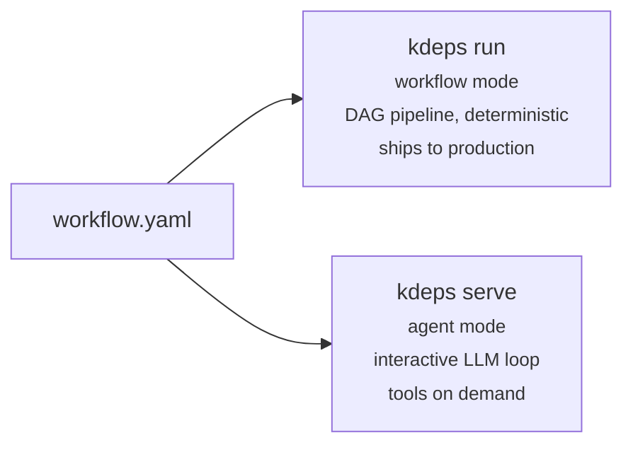

# Why kdeps?

kdeps exists because most AI tooling is built for prototyping, not for running unattended in production.

## The problem

Shipping AI into production means more than calling an API. You need deterministic pipelines, typed inputs and outputs, dependency ordering, retries, validation, and the ability to deploy anywhere -- not a chat session that ends when the browser tab closes.

kdeps is an **AI appliance builder**. You define what the agent does in YAML, and it runs as a self-contained unit -- an HTTP API, a bot, a file processor -- without a human in the loop.

## Two modes, one workflow file

Workflow mode is for production: inputs are validated, resources execute in a fixed order, output is predictable and auditable. Agent mode is for exploration: the LLM decides which workflows to call and in what order, with each workflow running as a complete pipeline.

The same `workflow.yaml` works in both. You do not need to rewrite anything to switch.

## Defined control flow

Chat interfaces are deliberately open-ended. kdeps workflow mode is the opposite: inputs are declared, dependencies are explicit, and validations fire before any LLM is called. If the input is wrong, the workflow fails fast with a clear error instead of hallucinating a response.

This is what makes workflow output reproducible, auditable, and safe to run unattended.

## Agencies

Single-agent workflows have limited scope. kdeps [agencies](/reference/glossary#agency) let you compose multiple specialized agents into a single system. Each agent has its own model, resources, and logic. They communicate via the `agent:` resource type, which runs another agent's full pipeline and returns its output -- every step is version-controlled, testable, and independently deployable.

## Who it is for

| Role | Use case |
|------|----------|
| Developers | Ship AI features into products (APIs, bots, internal tools) without glue code |
| Operations teams | Automate repetitive work: reports, triage, data entry, document processing |
| Marketing and growth | Content pipelines, SEO automation, campaign reporting |
| Any team | Replace a human clicking through tabs and copy-pasting between tools |

## See Also

- [Quick Start](/getting-started/quickstart) - Build your first workflow in minutes
- [Workflow Mode](/modes/workflow-mode) - Deterministic DAG pipelines
- [Agent Mode](/modes/agent-mode) - Autonomous LLM loop
