# Quickstart

Build a working LLM API in under five minutes.

## Prerequisites

Install kdeps:

```bash
# macOS / Linux
curl -LsSf https://raw.githubusercontent.com/kdeps/kdeps/main/install.sh | sh
```

Install and start Ollama (for local LLM):

```bash
# macOS / Linux
curl -fsSL https://ollama.ai/install.sh | sh
ollama pull llama3.2:1b
```

## Create a project

```bash
kdeps new my-agent
cd my-agent
```

Or create the structure manually:

```bash
mkdir -p my-agent/resources && cd my-agent
```

## Define your workflow

`workflow.yaml`:

```yaml
# workflow.yaml
apiVersion: kdeps.io/v1
kind: Workflow

metadata:
  name: my-agent
  version: "1.0.0"
  targetActionId: response

settings:
  apiServer:
    hostIp: "127.0.0.1"
    portNum: 16395
    routes:
      - path: /api/v1/chat
        methods: [POST]
```

## Add an LLM resource

`resources/llm.yaml`:

<div v-pre>

```yaml
# resources/llm.yaml
actionId: llm
validations:
  methods: [POST]
  routes: [/api/v1/chat]
  check:
    - get('q') != ''
  error:
    code: 400
    message: "'q' is required"
chat:
  model: llama3.2:1b
  role: user
  prompt: "{{ get('q') }}"
  timeout: 60s
```

</div>

## Add a response resource

`resources/response.yaml`:

```yaml
# resources/response.yaml
actionId: response
requires: [llm]
apiResponse:
  success: true
  response:
    answer: get('llm')
```

## Run it

```bash
kdeps run workflow.yaml
```

Test the API:

```bash
curl -X POST http://localhost:16395/api/v1/chat \
  -H "Content-Type: application/json" \
  -d '{"q": "What is entropy?"}'
```

Expected response:

```json
{
  "success": true,
  "response": {
    "answer": "Entropy is a measure of disorder..."
  }
}
```

## How it works

```mermaid
flowchart TD
    A(["POST /api/v1/chat<br/>{&quot;q&quot;: &quot;What is entropy?&quot;}"]) --> B
    B["resource: llm<br/><small>validates get&#40;'q'&#41; != ''; calls llama3.2:1b</small>"] -->|output stored as get&#40;'llm'&#41;| C
    C["resource: response<br/><small>requires: [llm]; reads get&#40;'llm'&#41;</small>"] --> D
    D(["{&quot;success&quot;: true, &quot;response&quot;: {&quot;answer&quot;: &quot;...&quot;}}"])
```



`requires: [llm]` means `response` will not run until `llm` has finished. This two-resource DAG is the simplest workflow mode pipeline.

## Try agent mode

Run the workflow as a tool in an interactive LLM loop. The whole workflow runs as a single tool -- the LLM calls it by name (`my-agent`), the full pipeline executes, and the result comes back.

```bash
kdeps serve workflow.yaml

# or point at a folder to expose every workflow inside as a separate tool
kdeps serve ./agents/
```

The agent REPL starts. Type a prompt and the LLM calls your resources as needed.

## See Also

- [Modes](/modes/workflow-mode) - Understand workflow and agent modes
- [Workflow Configuration](../configuration/workflow) - Full `workflow.yaml` reference
- [Resources Overview](../resources/overview) - All resource types
- [CLI Reference](/reference/cli/) - All commands and flags
