# Execution Flow

How kdeps resolves, orders, and runs resources in a workflow.

## Overview

When you run `kdeps run workflow.yaml` or call `POST /api/v1/run`, the engine:

1. Parses the workflow and builds a dependency graph from [`requires`](/reference/glossary#requires) fields
2. Detects cycles (fails fast if any exist)
3. Finds the [`targetActionId`](/reference/glossary#targetactionid) resource and walks its transitive dependencies
4. Topologically sorts resources so dependencies run before dependents
5. Executes resources in order -- resources without shared dependencies can run concurrently

## Execution Order

```mermaid
flowchart TD
    A(["Request at targetActionId"]) --> B
    B["1. Build dependency graph<br/><small>each resource = node; requires = edges<br/>fails fast on cycles</small>"] --> C
    C["2. Walk transitive deps<br/><small>backward from targetActionId<br/>collect only needed nodes</small>"] --> D
    D["3. Topological sort<br/><small>deps always run before dependents<br/>independent resources run concurrently</small>"] --> E
    E["4. Execute each resource<br/><small>a. before: block<br/>b. skip — any true? skip silently<br/>c. check — all true? proceed, else fail<br/>d. main action &#40;chat, sql, http...&#41;<br/>e. after: block<br/>f. onError handler</small>"] --> F
    F["5. Terminal resource<br/><small>apiResponse: formats output</small>"] --> G
    G(["JSON response returned"])
```



## Dependency Graph

### How requires works

<div v-pre>

```yaml
# workflow.yaml (conceptual)
resources:
  - actionId: fetchData
    httpClient:
      url: https://api.example.com/data

  - actionId: analyzeData
    requires: [fetchData]            # runs only after fetchData succeeds
    chat:
      prompt: "Analyze: {{ output('fetchData') }}"

  - actionId: respond
    requires: [analyzeData]          # runs only after analyzeData succeeds
    apiResponse:
      response: "{{ output('analyzeData') }}"

metadata:
  targetActionId: respond            # engine walks backward from here
```

</div>

Execution order: `fetchData` -> `analyzeData` -> `respond`

### Transitive dependencies

The engine resolves the full transitive closure. If A requires B, and B requires C, then C runs before both:

<div v-pre>

```yaml
# resources/example.yaml
- actionId: C
  exec:
    command: echo "first"

- actionId: B
  requires: [C]
  chat:
    prompt: "Build on: {{ output('C') }}"

- actionId: A
  requires: [B]
  apiResponse:
    response: "{{ output('B') }}"
```

</div>

Execution order: `C` -> `B` -> `A`

### Independent resources

Resources that don't depend on each other (neither directly nor transitively) can run concurrently:

<div v-pre>

```yaml
# resources/example.yaml
- actionId: fetchUsers
  httpClient:
    url: https://api.example.com/users

- actionId: fetchProducts                    # no requires -- independent of fetchUsers
  httpClient:
    url: https://api.example.com/products

- actionId: merge
  requires: [fetchUsers, fetchProducts]      # waits for both
  chat:
    prompt: "Users: {{ output('fetchUsers') }}, Products: {{ output('fetchProducts') }}"
```

</div>

`fetchUsers` and `fetchProducts` run concurrently. `merge` waits for both.

## Cycle Detection

The engine detects cycles during graph construction and fails fast with `ErrCodeDependencyCycle`:

```yaml
# This creates a cycle and will fail:
- actionId: A
  requires: [B]

- actionId: B
  requires: [A]    # cycle: A -> B -> A
```

## Skip vs Check

Both run before the main action, but they behave differently:

| | skip | check |
|---|---|---|
| Logic | ANY expression true triggers skip | ALL expressions must be true |
| On failure | Resource skipped silently, workflow continues | Workflow stops, error returned |
| Error code | N/A | Configurable via `validations.error.code` |
| Use case | Conditional execution, optional resources | Input validation, preconditions |

### Skip example

```yaml
# resources/example.yaml
validations:
  skip:
    - get('q') == ''          # if query is empty, skip this resource
```

### Check example

```yaml
# resources/example.yaml
validations:
  check:
    - get('apiKey') != nil    # must have API key
    - len(get('q')) <= 500    # query must be under 500 chars
  error:
    code: 400
    message: Missing API key or query too long
```

## Loop Execution

When a resource has a [`loop`](/reference/glossary#loop) config, the engine runs the full resource cycle (before -> check -> action -> after) repeatedly:

```mermaid
flowchart TD
    A(["loop starts"]) --> B
    B{"loop.condition<br/>is true?"} -->|yes| C
    B -->|no| G
    C["before: block"] --> D
    D["check &#40;every iteration&#41;"] --> E
    E["main action"] --> F
    F["after: block"] --> H
    H{"loop.every set?"} -->|yes| I
    H -->|no| J
    I["sleep&#40;every&#41;"] --> J
    J{"iteration >=<br/>maxIterations?"} -->|yes, safety cap| G
    J -->|no| B
    G(["loop ends"])
```



See [Loop](/concepts/loop) for full details.

## Agent Mode Execution

In agent mode (`kdeps serve`), the execution model differs:

1. Each workflow is registered as one tool (tool name = `metadata.name`)
2. Each agency is registered as one tool (tool name = `agency.metadata.name`); internal agents are not exposed individually
3. Components from each loaded workflow are also registered as individual callable tools
4. The LLM receives the user prompt and decides which tool to invoke
5. Workflow tool calls run the full DAG -- all `requires:` dependencies execute in order; `apiResponse.response` is returned to the LLM
6. Agency tool calls run the agency's entry-point pipeline; internal `agent:` resources resolve against the agency's agent map
7. Component tool calls run the component in isolation with inputs mapped to its interface fields
8. The LLM may call more tools or produce a final answer

Pointing at a single file registers one tool. Pointing at a folder registers one tool per workflow/agency found recursively (plus components). Resources are never registered as individual tools.

## See Also

- [Workflow Mode](/modes/workflow-mode) -- deterministic DAG pipelines
- [Agent Mode](/modes/agent-mode) -- LLM-driven tool calling
- [Validation & Control Flow](/concepts/validation-and-control) -- skip, check, and error handling
- [Loop](/concepts/loop) -- while-loop iteration
