# Agent Mode

Agent mode (`kdeps serve`) starts an interactive LLM loop where whole workflows and components are registered as callable tools. The LLM decides which tool to invoke based on the user's prompt. Workflow tools run the full pipeline atomically so all `requires:` dependencies resolve correctly. Component tools run a single reusable component in isolation. Individual resources are never exposed as tools directly.

## Single workflow vs folder

```bash
# One workflow = one tool (named after metadata.name)
kdeps serve ./my-agent/

# Folder = every workflow and agency inside becomes a separate tool
kdeps serve ./agents/
```

When you point to a folder, kdeps discovers every workflow and agency file inside it (recursively). Each becomes a separate tool. The tool name is `metadata.name` from the workflow's manifest -- not the filename.

## Concrete example

Given this workflow:

```yaml
# my-agent/workflow.yaml
apiVersion: kdeps.io/v1
kind: Workflow

metadata:
  name: my-agent          # this becomes the tool name the LLM sees
  version: "1.0.0"
  description: "Answers questions about our product"
  targetActionId: response

settings:
  apiServer:
    hostIp: "127.0.0.1"
    portNum: 16395
    routes:
      - path: /api/v1/chat
        methods: [POST]
```

Running:

```bash
kdeps serve ./my-agent/
```

The LLM receives one tool named `my-agent`. When it calls that tool, kdeps runs the full workflow DAG -- every resource in dependency order -- and returns `apiResponse.response` to the LLM.

The LLM never sees individual resources. It sees:

```
Tool: my-agent
Description: Answers questions about our product
Input: { "input": string }
```

## Folder mode -- multiple tools

```
agents/
  research/
    workflow.yaml    # metadata.name: research-agent
  writer/
    workflow.yaml    # metadata.name: writer-agent
  summarizer/
    workflow.yaml    # metadata.name: summarizer-agent
```

```bash
kdeps serve ./agents/
```

The LLM now has three tools: `research-agent`, `writer-agent`, `summarizer-agent`. It routes between them based on the user's prompt.

## How it works

```mermaid
flowchart TD
    A([user prompt]) --> B
    B["LLM receives prompt<br/><small>tool registry: one tool per workflow/agency + one per component</small>"] -->|LLM picks a tool| C
    C{"tool type?"} -->|workflow| D
    C -->|component| E
    D["kdeps runs full workflow pipeline<br/><small>all requires: deps resolve in order<br/>tool args become get&#40;'key'&#41; inside the workflow</small>"] -->|apiResponse returned to LLM| F
    E["kdeps runs component in isolation<br/><small>inputs map to component interface fields</small>"] -->|result returned to LLM| F
    F{"more tools<br/>needed?"} -->|yes| C
    F -->|no| G
    G([final answer])
```



Why whole workflows and not individual resources? A resource that calls `get('otherDep')` depends on an upstream resource having run first. If the LLM called that resource in isolation, the upstream data would be missing and the output would be wrong. Running the full workflow guarantees all dependencies execute in the correct order. Components are self-contained by design, so they can run independently as tools.

## Tool registration

| `kdeps serve` target | Tools registered |
|---|---|
| Single workflow file | One workflow tool (`metadata.name`) + one tool per component in that workflow |
| Single agency file | One tool per agent inside the agency + their components |
| Folder | One workflow tool per workflow/agency found recursively + all components |

Workflow tool input is forwarded as `get('key')` request params inside the pipeline. Output is the workflow's `apiResponse.response`. Component tool inputs map to the component's declared interface fields.

## When to use agent mode

- You want a conversational interface that dynamically picks which workflow to run.
- You have multiple specialized workflows and want the LLM to route between them.
- You are prototyping before formalizing a fixed pipeline in workflow mode.
- You are building a chatbot or assistant that calls your business logic on demand.

## Command

```bash
kdeps serve <path> [flags]
```

`<path>` is a workflow or agency file, or a directory. The tool name comes from `metadata.name` inside each file -- not from the filename itself.

### Flags

| Flag | Default | Description |
|---|---|---|
| `--model` | `KDEPS_AGENT_MODEL` or `llama3.2` | LLM model name |
| `--backend` | `KDEPS_AGENT_BACKEND` or `ollama` | LLM backend |
| `--base-url` | `KDEPS_AGENT_BASE_URL` | LLM API base URL |
| `--system` | (none) | System prompt injected at conversation start |
| `--debug` | false | Enable debug logging |

### Environment variables

```bash
KDEPS_AGENT_MODEL=llama3.2
KDEPS_AGENT_BACKEND=ollama
KDEPS_AGENT_BASE_URL=http://localhost:11434
```

## Examples

```bash
# Single workflow -- one tool
kdeps serve ./my-agent/

# All workflows in a folder
kdeps serve ./agents/

# Specify model and system prompt
kdeps serve ./agents/ --model mistral --system "You are a data analyst."

# OpenAI-compatible backend
KDEPS_AGENT_BACKEND=openai KDEPS_AGENT_BASE_URL=https://api.openai.com \
  kdeps serve ./agents/ --model gpt-4o
```

## Differences from workflow mode

| | Workflow mode (`kdeps run`) | Agent mode (`kdeps serve`) |
|---|---|---|
| Execution | DAG, deterministic | LLM loop, tool-driven |
| Entry point | `metadata.targetActionId` | User prompt |
| Unit of work | Individual resources | Whole workflows |
| Tools exposed | N/A | One per workflow + one per component |
| Input | Single workflow path | File or folder |

## See Also

- [Workflow Mode](workflow-mode) - Deterministic DAG pipelines
- [Agencies](/concepts/agency) - Multi-agent orchestration
- [CLI: Dev Commands](/reference/cli/dev) - `kdeps serve` flags
