# Agent Mode

Agent mode (`kdeps serve`) starts an interactive LLM loop where whole workflows are registered as callable tools. The LLM decides which workflow to invoke based on the user's prompt, runs it as a complete pipeline, and synthesizes the result. Individual resources inside a workflow are never exposed as tools -- the whole workflow runs atomically so all `requires:` dependencies resolve correctly.

## Single workflow vs folder

```bash
# One workflow = one tool
kdeps serve workflow.yaml

# Folder = all workflows and agencies in the folder become tools
kdeps serve ./agents/
```

When you point to a folder, kdeps discovers every `workflow.yaml` and `agency.yaml` inside it (recursively). Each becomes a separate tool. The tool name is `metadata.name` from the workflow's manifest.

## How it works

```mermaid
flowchart TD
    A([user prompt]) --> B
    B["LLM receives prompt<br/><small>tool registry: one tool per workflow/agency</small>"] -->|LLM picks a workflow| C
    C["kdeps runs full workflow pipeline<br/><small>all requires: deps resolve in order<br/>tool args become get&#40;'key'&#41; inside the workflow</small>"] -->|apiResponse returned to LLM| D
    D{"more workflows<br/>needed?"} -->|yes| C
    D -->|no| E
    E([final answer])
```



Why whole workflows? A resource that calls `get('otherDep')` depends on an upstream resource having run first. If the LLM called that resource in isolation, the upstream data would be missing and the output would be wrong. Running the full workflow guarantees all dependencies execute in the correct order.

## Tool registration

| `kdeps serve` target | Tools registered |
|---|---|
| `workflow.yaml` | One tool: `metadata.name` of that workflow |
| `agency.yaml` | One tool per agent inside the agency |
| `./folder/` | One tool per `workflow.yaml` and `agency.yaml` found recursively |

Tool input schema is derived from the workflow's declared routes and validations. Tool output is the workflow's `apiResponse.response`.

## When to use agent mode

- You want a conversational interface that dynamically picks which workflow to run.
- You have multiple specialized workflows and want the LLM to route between them.
- You are prototyping before formalizing a fixed pipeline in workflow mode.
- You are building a chatbot or assistant that calls your business logic on demand.

## Command

```bash
kdeps serve <path> [flags]
```

`<path>` is either a single `workflow.yaml` / `agency.yaml` file, or a folder.

### Flags

| Flag | Default | Description |
|---|---|---|
| `--model` | `KDEPS_AGENT_MODEL` or `llama3.2` | LLM model name |
| `--backend` | `KDEPS_AGENT_BACKEND` or `ollama` | LLM backend |
| `--base-url` | `KDEPS_AGENT_BASE_URL` | LLM API base URL |
| `--system` | (none) | System prompt injected at conversation start |
| `--debug` | false | Enable debug logging |

### Environment variables

```bash
KDEPS_AGENT_MODEL=llama3.2
KDEPS_AGENT_BACKEND=ollama
KDEPS_AGENT_BASE_URL=http://localhost:11434
```

## Examples

```bash
# One workflow as the single tool
kdeps serve workflow.yaml

# All workflows in a folder become tools
kdeps serve ./agents/

# Specify model and system prompt
kdeps serve ./agents/ --model mistral --system "You are a data analyst."

# OpenAI-compatible backend
KDEPS_AGENT_BACKEND=openai KDEPS_AGENT_BASE_URL=https://api.openai.com \
  kdeps serve ./agents/ --model gpt-4o
```

## Differences from workflow mode

| | Workflow mode (`kdeps run`) | Agent mode (`kdeps serve`) |
|---|---|---|
| Execution | DAG, deterministic | LLM loop, tool-driven |
| Entry point | `metadata.targetActionId` | User prompt |
| Unit of work | Individual resources | Whole workflows |
| Tool granularity | N/A | One tool per workflow |
| Input | `<path>` is a single workflow | `<path>` is a file or folder |

## See Also

- [Workflow Mode](workflow-mode) - Deterministic DAG pipelines
- [Agencies](/concepts/agency) - Multi-agent orchestration
- [CLI: Dev Commands](/reference/cli/dev) - `kdeps serve` flags
